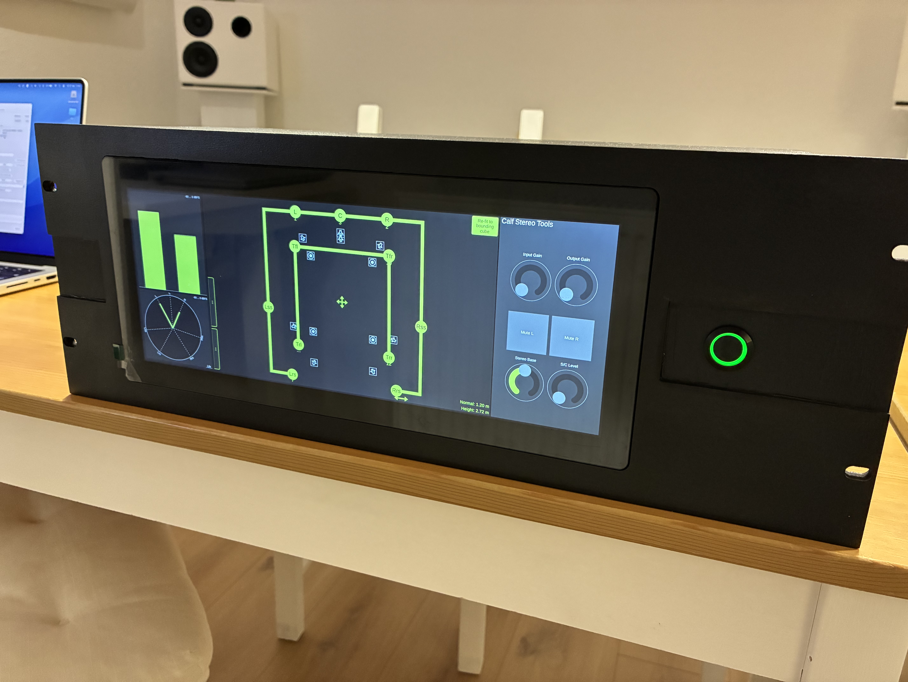

# Raspberry123DSI

A Raspberry Pi 5 kiosk system running three audio applications side-by-side on a 12.3" DSI touchscreen, housed in a self-built laser-cut plywood rack enclosure. This guide walks through the full build and configuration from enclosure assembly to audio routing.

## Gallery

Prototype UI on screen

Installed in studio rack

Paint job

Back panel

&#x25B6;
Boot-up video

## System Overview

| Component | Details |
|:----------|:--------|
| **Controller** | Raspberry Pi 5 (64-bit Raspberry Pi OS, Debian Trixie) |
| **Display** | Waveshare 12.3" DSI touchscreen (720×1920, rotated 270°) |
| **Display config** | kanshi (Wayland output profile daemon) |
| **Window Manager** | Sway (Wayland compositor, tile-based) |
| **Audio interface** | RME Digiface Dante (USB, 16×16, 48kHz/32-bit) via ALSA |
| **Network** | Ethernet with IPv4 link-local for Dante device discovery |
| **Applications** | Mema.Mo (audio monitor) · Umsci (DS100 control) · Mema.Re (remote) |

## Build Guide

Follow these steps to build and configure the system from scratch:

<a class="guide-card" href="rack-assembly.html">

Step 1

Enclosure Assembly

Laser-cut part list, layer stack order, dimensions, and photos of the finished rack enclosure.

</a>

<a class="guide-card" href="os-setup.html">

Step 2

OS Setup

Raspberry Pi OS configuration: bootloader, kernel parameters, Sway window manager, kanshi display profile, and session startup.

</a>

<a class="guide-card" href="audio-config.html">

Step 3

Audio Configuration

ALSA/Dante routing, LV2 DSP plugin chain setup, and audio device configuration for the RME Digiface Dante.

</a>

## Files

All raw configuration files are in the [config/](https://github.com/ChristianAhrens/Raspberry123DSI/tree/main/config) directory of the repository.

All laser-cut SVG files are in the [assets/](https://ChristianAhrens.github.io/Raspberry123DSI/assets/) directory of the deployed site.

## Related Projects

| Project | Description |
|:--------|:------------|
| [**Umsci**](https://github.com/ChristianAhrens/Umsci) | Spatial audio control surface for d&b Soundscape DS100 |
| [**Mema**](https://github.com/ChristianAhrens/Mema) | Audio matrix routing family (Mema, Mema.Mo, Mema.Re) |

---

*Use what is provided here at your own risk.*
