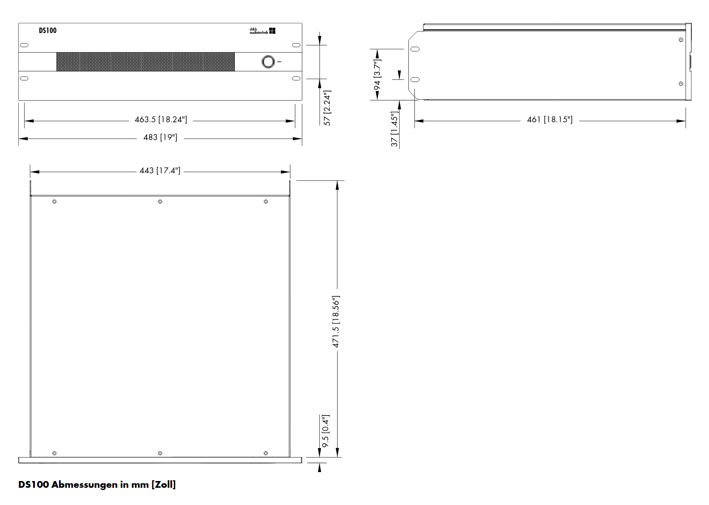

# Enclosure Assembly

The rack enclosure is a multi-layer laser-cut assembly designed to house a Raspberry Pi 5, DSI touchscreen, and RME Dante audio interface in a professional rack-mountable form factor.

## Photos & Video

<div class="gallery">

<div class="gallery-item" data-src="../assets/RackEnclosure-UpmixProtoUI.jpeg" onclick="openLightbox(this)">

<span class="gallery-caption">Prototype UI on screen</span>
</div>

<div class="gallery-item" data-src="../assets/RackEnclosure-InStudioRack.jpeg" onclick="openLightbox(this)">

<span class="gallery-caption">Installed in studio rack</span>
</div>

<div class="gallery-item" data-src="../assets/RackEnclosure-PaintJob.jpeg" onclick="openLightbox(this)">

<span class="gallery-caption">Paint job</span>
</div>

<div class="gallery-item" data-src="../assets/RackEnclosure-Backpanel.jpeg" onclick="openLightbox(this)">

<span class="gallery-caption">Back panel</span>
</div>

<div class="gallery-item video-thumb" data-src="../assets/RackEnclosure-BootupUpmixProto.mp4" data-type="video" onclick="openLightbox(this)">

<span class="gallery-play">&#x25B6;</span>
<span class="gallery-caption">Boot-up video</span>
</div>

</div>

## Part List

All files are SVG vector graphics suitable for laser cutting. Download them from the [assets/](https://ChristianAhrens.github.io/Raspberry123DSI/assets/) directory or directly from [rack_enclosure/](https://github.com/ChristianAhrens/Raspberry123DSI/tree/main/rack_enclosure) on GitHub.

| Layer | File | Material | Thickness | Qty |
|:------|:-----|:---------|:----------|:----|
| 01 | [01_Designfront_3mm_Inkscape.svg](https://github.com/ChristianAhrens/Raspberry123DSI/blob/main/rack_enclosure/01_Designfront_3mm_Inkscape.svg) | Plywood | 3mm | 1× |
| 02 | [02_Front_6mm_Inkscape.svg](https://github.com/ChristianAhrens/Raspberry123DSI/blob/main/rack_enclosure/02_Front_6mm_Inkscape.svg) | Plywood | 6mm | 1× |
| 03 | [03_DSIScreenBodycutout_3mm_Inkscape.svg](https://github.com/ChristianAhrens/Raspberry123DSI/blob/main/rack_enclosure/03_DSIScreenBodycutout_3mm_Inkscape.svg) | Plywood | 3mm | 1× |
| 04 | [04_DSIScreenMounting_6mm_Inkscape.svg](https://github.com/ChristianAhrens/Raspberry123DSI/blob/main/rack_enclosure/04_DSIScreenMounting_6mm_Inkscape.svg) | Plywood | 6mm | 1× |
| 05 | [05_DualVolumeBody_6mm_Inkscape.svg](https://github.com/ChristianAhrens/Raspberry123DSI/blob/main/rack_enclosure/05_DualVolumeBody_6mm_Inkscape.svg) | Plywood | 6mm | 3× |
| 06 | [06_SingleVolumeBody_10mm_Inkscape.svg](https://github.com/ChristianAhrens/Raspberry123DSI/blob/main/rack_enclosure/06_SingleVolumeBody_10mm_Inkscape.svg) | Plywood | 10mm | 10× |
| 07 | [07_DualVolumeBody_BackplateMount_6mm_Inkscape.svg](https://github.com/ChristianAhrens/Raspberry123DSI/blob/main/rack_enclosure/07_DualVolumeBody_BackplateMount_6mm_Inkscape.svg) | Plywood | 6mm | 1× |
| 08 | [08_BackplateWFan_6mm_Inkscape.svg](https://github.com/ChristianAhrens/Raspberry123DSI/blob/main/rack_enclosure/08_BackplateWFan_6mm_Inkscape.svg) | Plywood | 6mm | 1× |

The combined-layers overview file [00_All_Layers_Inkscape.svg](https://github.com/ChristianAhrens/Raspberry123DSI/blob/main/rack_enclosure/00_All_Layers_Inkscape.svg) shows all panels in a single Inkscape document.


## Layer Stack Order

The layers stack in the following order (front to back):

```
01_Designfront (3mm)
02_Front       (6mm)
03_DSIScreenBodycutout (3mm)
04_DSIScreenMounting   (6mm)
05_DualVolumeBody      (6mm) × 3
06_SingleVolumeBody    (10mm) × 10
07_DualVolumeBody_BackplateMount (6mm)
08_BackplateWFan       (6mm)
```

## Dimensions

| Assembly | Thickness |
|:---------|:----------|
| Front panels (01 + 02) | 9mm |
| Total enclosure depth | ~139mm |

The total depth is calculated as: front (3mm + 6mm) + body cutout (3mm) + screen mounting (6mm) + dual body × 3 (18mm) + single body × 10 (100mm) + backplate mount (6mm) + backplate with fan (6mm) = **148mm** (approximate, depends on exact layer overlaps).

## Reference Dimensions

The enclosure is designed around the d&b Soundscape DS100 form factor. The dimensional reference below was used during the design process:



---

*Use what is provided here at your own risk.*
